# Customer Segmentation: Clustering
Using clustering model to identify different customer groups for marketing strategy customization.

## 1. Introduction

**Definition:**

Customer clustering is the grouping of customers based on their similarities to better understand and meet the needs of different groups.

**Significance:**
- Personalized Marketing and Service
- Enhanced Customer Satisfaction and Loyalty
- Increased Sales and Profits
- Predictive Insights and Planning

**About Dataset:**

This dataset comes from Kaggle. It contains 1000+ data items and 27 variables. The main dimensions are people, products, promotions and channels.

## 2. Data Preprocessing

**Data cleaning:** 

Delete NULL value, change the data types, drop outliers, do feature engineering and Scale the feature using the standard scaler.

**Principal Component Analysis:**

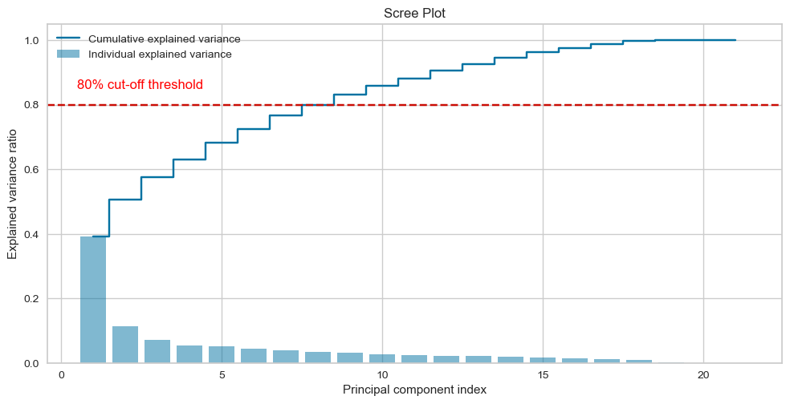

I picked eight principal component while maintaining 80% explanatory power for the variance of the variables.

## 3. Clustering Model

**Model introuction:**

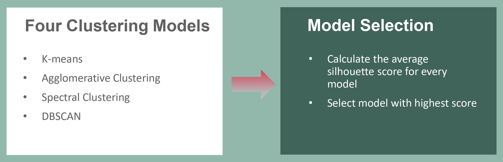

**Four different models:**

**K-means**
- Choose cluster number: Calculate distortion score and use Elbow rule to select clusters = 4.

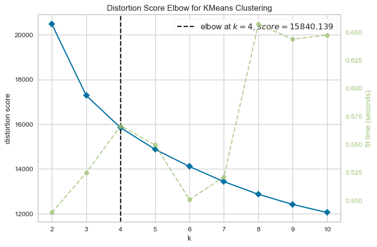

- Calculate average silhouette score = 0.1911.

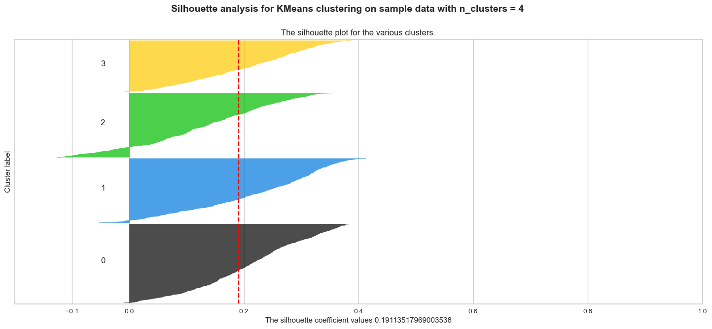

**Agglomerative Clustering**
- Choose cluster number: use Dendrogram to find clusters with the longest merge distance, and finally set clusters = 3.
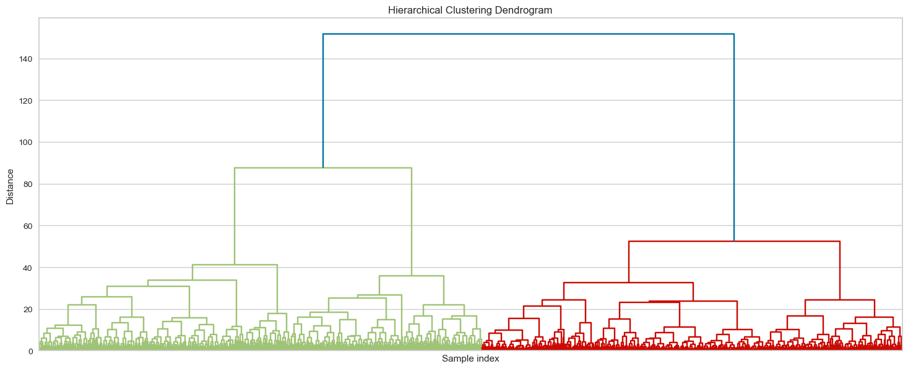

- Calculate average silhouette score = 0.2507
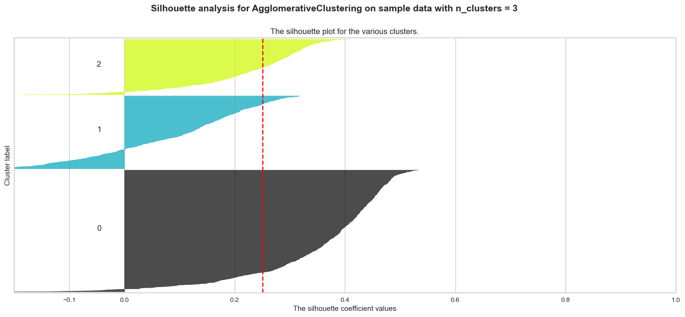

**Spectral Clustering**
- Choose cluster number: calculate eigen gaps and select cluster number with highest gap size, and finally set clusters = 3.
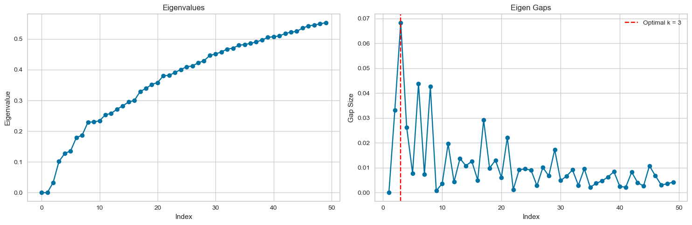

- Calculate average silhouette score = 0.1999
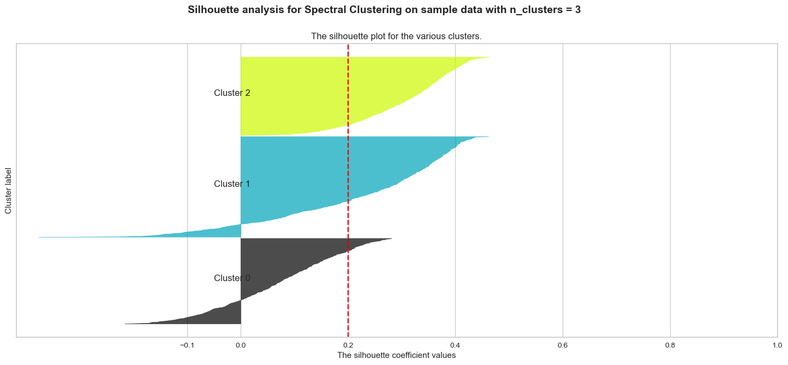

**DBSCAN**
- No need to set cluster number in advance, calculate average silhouette score = 0.2487.
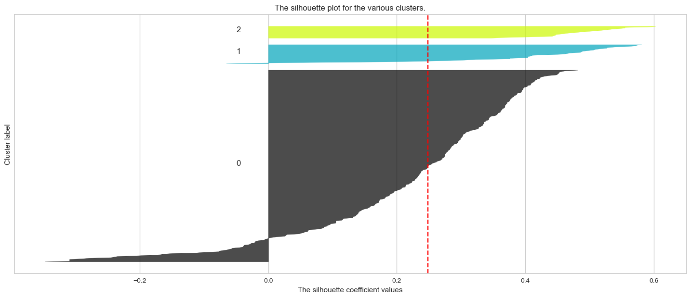

- “d_cluster” is the cluster label through DBSCAN
- “-1” label means noisy point
- Distribution of cluster is markedly uneven, and many data points are clustered as noisy point --> Not a suitable model
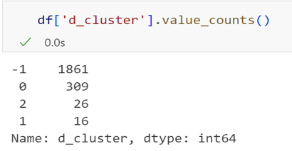

**Final selection and Cluster distribution:**
- Select Agglomerative Clustering finally

- The clusters seem to be fairly distributed
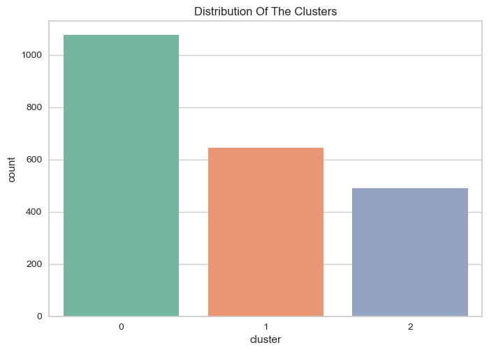

## 4. Exploratory Data Analysis

## 5. Customer Profile

## 6.Market strategy for different clusters

