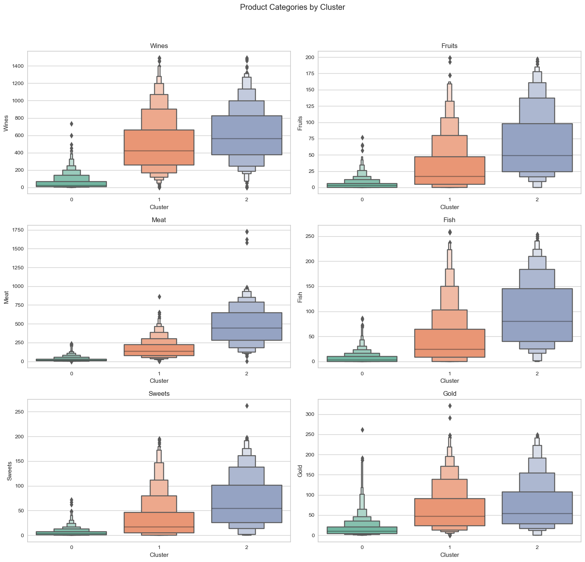

# Customer Segmentation: Clustering
Using clustering model to identify different customer groups for marketing strategy customization.

## 1. Introduction

**Definition:**

Customer clustering is the grouping of customers based on their similarities to better understand and meet the needs of different groups.

**Significance:**
- Personalized Marketing and Service
- Enhanced Customer Satisfaction and Loyalty
- Increased Sales and Profits
- Predictive Insights and Planning

**About Dataset:**

This dataset comes from Kaggle. It contains 1000+ data items and 27 variables. The main dimensions are people, products, promotions and channels.

## 2. Data Preprocessing

**Data cleaning:** 

Delete NULL value, change the data types, drop outliers, do feature engineering and Scale the feature using the standard scaler.

**Principal Component Analysis:**

I picked eight principal component while maintaining 80% explanatory power for the variance of the variables.

## 3. Clustering Model

**Model introuction:**

**Four different models:**

**K-means**
- Choose cluster number: Calculate distortion score and use Elbow rule to select clusters = 4.

- Calculate average silhouette score = 0.1911.

**Agglomerative Clustering**
- Choose cluster number: use Dendrogram to find clusters with the longest merge distance, and finally set clusters = 3.

- Calculate average silhouette score = 0.2507

**Spectral Clustering**
- Choose cluster number: calculate eigen gaps and select cluster number with highest gap size, and finally set clusters = 3.

- Calculate average silhouette score = 0.1999

**DBSCAN**
- No need to set cluster number in advance, calculate average silhouette score = 0.2487.

- “d_cluster” is the cluster label through DBSCAN
- “-1” label means noisy point
- Distribution of cluster is markedly uneven, and many data points are clustered as noisy point --> Not a suitable model

**Final selection and Cluster distribution:**
- Select Agglomerative Clustering finally

- The clusters seem to be fairly distributed

## 4. Exploratory Data Analysis

**Customer Features**
- Kernel Density Estimate plot
- Final analysis shown in profile part

- high income customers have higher total spent.
- Total spent: Cluster2 > Cluster 1 > Cluster 0

- High-income customers do not necessarily make more frequent purchases,may because they prefer high-value goods

**Product Preference**
- Total purchase number: Cluster2 > Cluster 1> Cluster 0
- Cluster 2 spends more than the other two groups on most product categories, especially on “Meat” and “Wine” products.

**Purchase Channel**
- Cluster 1 and Cluster2 is active across all channel. 
- Web shopping: Cluster 1 > Cluster 2, Catalog shopping: Cluster 2 > Cluster1.
- Cluster 0 makes relatively few purchases across all channels, which may indicate that they buy less frequently overall.

    
    
    

**Customer Activation**
- The majority of customers tended not to take up any promotions, cluster2 participated in a relatively high number of promotions

- Cluster2 has the lowest website activity, the other two clusters are similar

## 5. Customer Profile
- Different characteristics

- Common characteristics

## 6.Market strategy for different clusters

